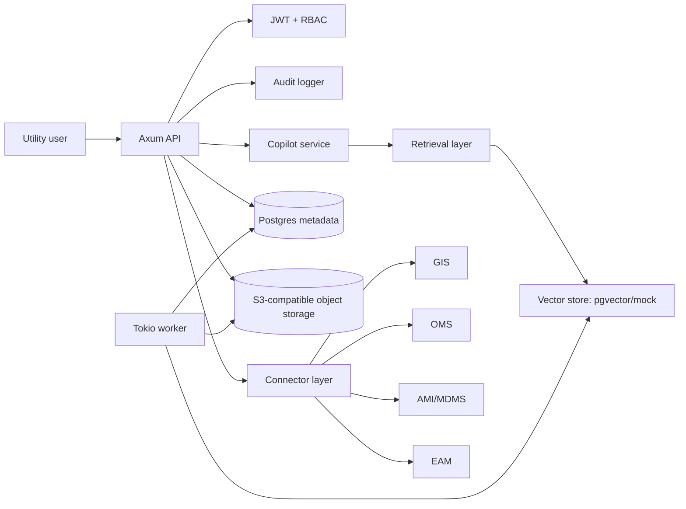

# grid-forge

**grid-forge** is a Rust-first backend platform for AI copilots used by electric distribution utilities. It is designed for engineering, regulatory, and customer operations workflows where auditability, citations, and human approval matter more than generic chat.

This starter repo is intentionally practical: an Axum API, async worker, domain crates, SQLx/PostgreSQL migrations, object-storage abstraction, retrieval-augmented AI interfaces, JWT auth, RBAC, audit logging, OpenAPI docs, Docker Compose, sample utility data, and realistic utility documents.

> Product thesis: utility teams do not need a novelty chatbot. They need a governed operations copilot that can search fragmented systems, draft grounded work products, and leave a clear audit trail.

## Why utilities?

Electric utilities run on fragmented operational knowledge:

- GIS asset records
- SCADA and historian telemetry
- AMI/MDMS meter events
- OMS outage data
- CIS/customer tickets
- EAM/work orders
- PDFs, SOPs, manuals, regulatory orders, and rate-case filings

Engineers, regulatory analysts, and customer operations teams lose time searching, summarizing, reconciling, and drafting across these systems. grid-forge is the foundation for a vertical AI infrastructure product that helps utility teams work faster without bypassing safety, compliance, or human accountability.

## Supported workflows

### 1. Engineering Copilot

- Asset and feeder search
- Work order summarization
- Outage triage summaries
- Load / asset risk notes
- Document-grounded Q&A over manuals, SOPs, and maintenance guides

### 2. Regulatory Copilot

- Upload filings, orders, and rate-case documents
- Semantic search across regulatory documents
- Draft response memos with citations
- Preserve source trails for audit and review

### 3. Customer Ops Copilot

- Summarize inbound complaints and tickets
- Classify issue type
- Draft customer-safe responses
- Suggest escalation path
- Explain outages without leaking sensitive operational details

## Why auditability and citations matter

Utility AI outputs can influence reliability, compliance, safety communications, and customer trust. grid-forge treats every grounded AI action as an auditable event:

- AI outputs include citation objects when grounded in documents.
- Sensitive prompts can require human approval before finalization.
- Audit events capture actor, module, resource, citations, confidence, and review flags.
- Demo mode and production mode are explicitly separated.

## Why Rust?

Rust is a strong fit for high-reliability utility infrastructure software:

- Memory safety without a garbage collector
- Efficient async I/O with Tokio
- Strong type boundaries across auth, domain, connectors, AI, and audit layers
- Good ergonomics for secure services and long-running workers
- Predictable deployments for enterprise environments

## Repo layout

```text
apps/api          Axum REST API, OpenAPI docs, JWT/RBAC enforcement
apps/worker       Async worker placeholder for ingestion, embedding, and agent jobs
apps/web          Minimal placeholder for future operator UI
crates/domain     Domain entities and shared schemas
crates/common     Config, errors, telemetry
crates/db         SQLx/Postgres and object storage abstractions
crates/ai         LLM, embedding, vector store, retrieval, copilot services
crates/connectors Connector trait boundaries for GIS/SCADA/AMI/OMS/CIS/EAM
crates/auth       JWT demo auth and RBAC
crates/audit      Audit logger trait and in-memory implementation
docs              Architecture, domain, API, security, use cases
examples          Seed data, mock utility docs, curl examples
deploy            Docker and Kubernetes deployment scaffolding
migrations        SQLx migrations
```

## Quick start

### Prerequisites

- Rust 1.84+
- Docker + Docker Compose
- Optional: `sqlx-cli` for applying migrations locally

### Run API in demo mode

```bash
cp .env.example .env
cargo run -p grid-forge-api
```

OpenAPI docs: <http://localhost:8080/docs>

### Login as a demo user

```bash
curl -s http://localhost:8080/auth/login \
  -H 'content-type: application/json' \
  -d '{"email":"engineer@cedar-rapids.example","password":"demo-password"}'
```

Demo users:

| Email | Role |
| --- | --- |
| `engineer@cedar-rapids.example` | Utility engineer |
| `regulatory@cedar-rapids.example` | Regulatory analyst |
| `customerops@cedar-rapids.example` | Customer ops |
| `opsmanager@cedar-rapids.example` | Ops manager |
| `auditor@cedar-rapids.example` | Auditor |
| `admin@cedar-rapids.example` | Admin |

### Example: engineering outage summary

```bash
TOKEN=$(curl -s http://localhost:8080/auth/login \
  -H 'content-type: application/json' \
  -d '{"email":"engineer@cedar-rapids.example","password":"demo-password"}' \
  | python3 -c 'import json,sys; print(json.load(sys.stdin)["token"])')

curl -s http://localhost:8080/engineering/outage-summary \
  -H "authorization: Bearer $TOKEN" \
  -H 'content-type: application/json' \
  -d '{"outageNumber":"OUT-2026-0417","fieldNotes":"Feeder F-12 locked out after storm. AMI last-gasp cluster near Oak Substation. Crew reports possible tree contact."}' \
  | python3 -m json.tool
```

### Example: regulatory draft

```bash
TOKEN=$(curl -s http://localhost:8080/auth/login \
  -H 'content-type: application/json' \
  -d '{"email":"regulatory@cedar-rapids.example","password":"demo-password"}' \
  | python3 -c 'import json,sys; print(json.load(sys.stdin)["token"])')

curl -s http://localhost:8080/regulatory/draft \
  -H "authorization: Bearer $TOKEN" \
  -H 'content-type: application/json' \
  -d '{"docketNumber":"24-017","question":"Draft a short response describing reliability improvement reporting obligations."}' \
  | python3 -m json.tool
```

### Example: customer interaction classification

```bash
TOKEN=$(curl -s http://localhost:8080/auth/login \
  -H 'content-type: application/json' \
  -d '{"email":"customerops@cedar-rapids.example","password":"demo-password"}' \
  | python3 -c 'import json,sys; print(json.load(sys.stdin)["token"])')

curl -s http://localhost:8080/customer-interactions/classify \
  -H "authorization: Bearer $TOKEN" \
  -H 'content-type: application/json' \
  -d '{"rawText":"My power has been out for three hours and the outage map keeps changing the restoration time."}' \
  | python3 -m json.tool
```

More examples live in [`examples/curl`](examples/curl).

## Local development with Docker Compose

```bash
docker-compose up --build
```

This starts:

- Postgres with pgvector
- MinIO for S3-compatible object storage
- API service
- Worker service

Apply migrations manually if running outside Compose:

```bash
sqlx migrate run --source migrations
psql "$GRID_FORGE_DATABASE_URL" -f examples/seed/fictional_utility.sql
```

## API surface

- `POST /auth/login`
- `GET /me`
- `POST /documents`
- `POST /documents/:id/process`
- `GET /documents/:id`
- `POST /search`
- `POST /agent-runs`
- `GET /agent-runs/:id`
- `GET /audit-events`
- `POST /connectors`
- `POST /customer-interactions/classify`
- `POST /regulatory/draft`
- `POST /engineering/outage-summary`

## Architecture



See [`docs/architecture.md`](docs/architecture.md) for more detail.

## Production boundaries

This repo includes a safe demo implementation. Before production use:

- Replace demo auth with enterprise IdP integration.
- Replace mock LLM/embedding providers with approved providers or self-hosted models.
- Use real S3-compatible object storage and encrypted buckets.
- Apply tenant isolation checks at every repository boundary.
- Configure audit log retention, export, and immutability.
- Add SOC2 controls around access reviews, change management, incident response, vendor risk, and evidence collection.

## Commercial product path for Yabloko Labs

grid-forge can become a utility-focused commercial product by narrowing the first wedge, integrating deeply with one or two systems, and selling measurable workflow time savings:

1. Start with one repeatable workflow, such as outage communications summaries or regulatory memo drafting.
2. Offer a secure pilot with customer-owned documents, citations, and approval workflow.
3. Add connector packs for OMS, AMI/MDMS, and GIS after proving document-grounded value.
4. Package audit exports and compliance reporting as enterprise differentiators.
5. Expand from copilot to workflow orchestration only after trust and governance are established.

## Alternative repo names

1. **grid-ledger** — emphasizes audit trails, citations, and operational provenance.
2. **volt-ops** — concise, operational, utility-specific.
3. **relay-stack** — evokes grid relay infrastructure and modular SaaS foundations.

I kept **grid-forge** because it sounds infrastructure-oriented without being gimmicky.

## Narrow MVP wedges

1. **Outage communications copilot** — OMS + SOP grounded summaries for customer ops and ops managers.
2. **Regulatory response memo copilot** — cite filings, orders, and reliability reports for analysts.
3. **Asset maintenance note copilot** — summarize transformer/feeder risk from work orders, manuals, and inspection notes.

## First issues after scaffold

1. Add persistent Postgres repositories for documents, chunks, agent runs, and audit events.
2. Implement pgvector-backed retrieval and embedding provider adapters.
3. Add S3/MinIO object-store implementation and signed upload URLs.
4. Add IdP-ready auth middleware with tenant-scoped claims and row-level security tests.
5. Build first connector adapter for a mock OMS export, then map it into outage summary workflows.

## Non-goals

- No autonomous switching, dispatch, billing, or regulatory submission actions.
- No direct SCADA writes or pretend SCADA integration.
- No generic chatbot starter-kit behavior.
- No hardcoded production secrets.
- No unsupported claims without citations for grounded answers.

## License

Dual-licensed under MIT or Apache-2.0.
