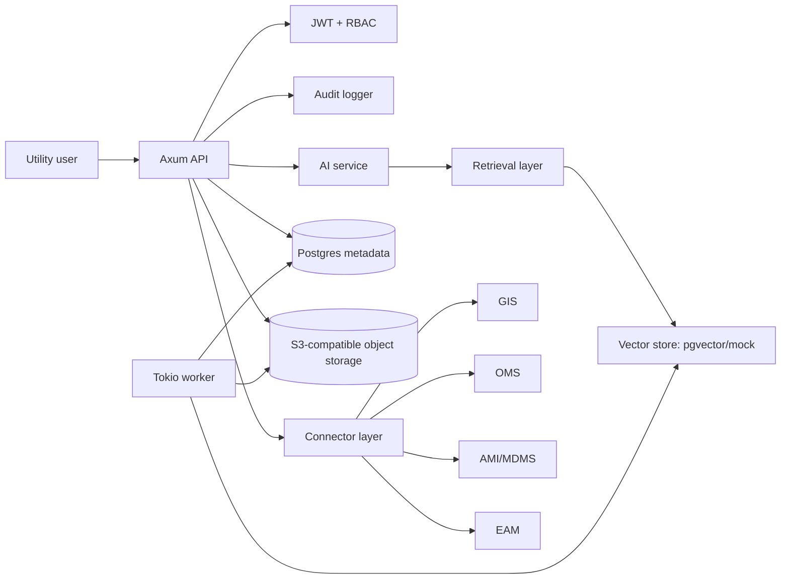

# grid-forge

[](https://github.com/yablokolabs/grid-forge/actions/workflows/ci.yml)
[](LICENSE-MIT)
[](https://www.rust-lang.org)

**grid-forge** is a Rust-first backend platform for AI-assisted operations used by electric distribution utilities. It is designed for engineering, regulatory, and customer operations workflows where auditability, citations, and human approval matter more than generic chat.

> **Product thesis:** utility teams don't need a novelty chatbot — they need a governed operations platform that can search fragmented systems, draft grounded work products, and leave a clear audit trail.

---

## Table of Contents

- [Why Utilities?](#why-utilities)
- [Supported Workflows](#supported-workflows)
- [Architecture](#architecture)
- [Repo Layout](#repo-layout)
- [Quick Start](#quick-start)
- [Usage Examples](#usage-examples)
- [Local Development](#local-development)
- [API Reference](#api-reference)
- [Production Boundaries](#production-boundaries)
- [Contributing](#contributing)
- [License](#license)

---

## Why Utilities?

Electric utilities run on fragmented operational knowledge:

- GIS asset records
- SCADA and historian telemetry
- AMI/MDMS meter events
- OMS outage data
- CIS/customer tickets
- EAM/work orders
- PDFs, SOPs, manuals, regulatory orders, and rate-case filings

Engineers, regulatory analysts, and customer operations teams lose time searching, summarizing, reconciling, and drafting across these systems. grid-forge is the foundation for a vertical AI infrastructure product that helps utility teams work faster without bypassing safety, compliance, or human accountability.

## Supported Workflows

### 1. Engineering Operations

- Asset and feeder search
- Work order summarization
- Outage triage summaries with document-grounded citations
- Load / asset risk notes
- Q&A over manuals, SOPs, and maintenance guides

### 2. Regulatory Operations

- Upload filings, orders, and rate-case documents
- Semantic search across regulatory documents
- Draft response memos with citations
- Preserve source trails for audit and review

### 3. Customer Operations

- Summarize inbound complaints and tickets
- Classify issue type
- Draft customer-safe responses
- Suggest escalation path
- Explain outages without leaking sensitive operational details

### Why Auditability and Citations Matter

Utility AI outputs can influence reliability, compliance, safety communications, and customer trust. grid-forge treats every grounded AI action as an auditable event:

- AI outputs include citation objects when grounded in documents
- Sensitive prompts can require human approval before finalization
- Audit events capture actor, module, resource, citations, confidence, and review flags
- Demo mode and production mode are explicitly separated

## Architecture



See [`docs/architecture.md`](docs/architecture.md) for detailed architecture documentation.

### Why Rust?

- Memory safety without a garbage collector
- Efficient async I/O with Tokio
- Strong type boundaries across auth, domain, connectors, AI, and audit layers
- Good ergonomics for secure services and long-running workers
- Predictable deployments for enterprise environments

## Repo Layout

```text
apps/api          Axum REST API, OpenAPI docs, JWT/RBAC enforcement
apps/worker       Async worker for ingestion, embedding, and agent jobs
crates/domain     Domain entities and shared schemas
crates/common     Config, errors, telemetry
crates/db         SQLx/Postgres and object storage abstractions
crates/ai         LLM, embedding, vector store, retrieval services
crates/connectors Connector trait boundaries for GIS/SCADA/AMI/OMS/CIS/EAM
crates/auth       JWT demo auth and RBAC
crates/audit      Audit logger trait and in-memory implementation
docs/             Architecture, domain model, API, security, use-case docs
examples/         Seed data, mock utility docs, curl examples
deploy/           Docker and Kubernetes deployment scaffolding
migrations/       SQLx database migrations
```

## Quick Start

### Prerequisites

- [Rust 1.84+](https://rustup.rs/)
- [Docker](https://docs.docker.com/get-docker/) + Docker Compose
- Optional: [`sqlx-cli`](https://crates.io/crates/sqlx-cli) for applying migrations locally

### 1. Clone and configure

```bash
git clone https://github.com/yablokolabs/grid-forge.git
cd grid-forge
cp .env.example .env
```

### 2. Run API in demo mode

```bash
cargo run -p grid-forge-api
```

The API starts on `http://localhost:8080`. OpenAPI docs are served at <http://localhost:8080/docs>.

### 3. Verify the API is running

```bash
curl -s http://localhost:8080/health | python3 -m json.tool
```

```json
{
    "ok": true,
    "service": "grid-forge-api",
    "demoMode": true
}
```

---

## Usage Examples

All examples assume the API is running locally on port 8080. The demo ships with six pre-configured users — no database required in demo mode.

### Demo Users

| Email | Role | Permissions |
| --- | --- | --- |
| `engineer@cedar-rapids.example` | Engineer | Engineering operations, document search |
| `regulatory@cedar-rapids.example` | Regulatory Analyst | Regulatory drafting, document search |
| `customerops@cedar-rapids.example` | Customer Ops | Customer interaction classification |
| `opsmanager@cedar-rapids.example` | Ops Manager | All operational modules |
| `auditor@cedar-rapids.example` | Auditor | Audit event viewer |
| `admin@cedar-rapids.example` | Admin | Full access |

> **Password for all demo users:** `demo-password`

### Authenticate and Get a Token

```bash
# Login and extract the JWT token
TOKEN=$(curl -s http://localhost:8080/auth/login \
  -H 'content-type: application/json' \
  -d '{"email":"engineer@cedar-rapids.example","password":"demo-password"}' \
  | python3 -c 'import json,sys; print(json.load(sys.stdin)["token"])')

echo "$TOKEN"
```

### Check Current User

```bash
curl -s http://localhost:8080/me \
  -H "authorization: Bearer $TOKEN" \
  | python3 -m json.tool
```

```json
{
    "userId": "11111111-1111-4111-8111-111111111111",
    "organizationId": "00000000-0000-4000-8000-000000000001",
    "email": "engineer@cedar-rapids.example",
    "role": "engineer",
    "permissions": ["read_documents", "ingest_documents", "run_engineering_copilot"]
}
```

### Engineering: Outage Summary

Generate a grounded outage triage summary from field notes:

```bash
TOKEN=$(curl -s http://localhost:8080/auth/login \
  -H 'content-type: application/json' \
  -d '{"email":"engineer@cedar-rapids.example","password":"demo-password"}' \
  | python3 -c 'import json,sys; print(json.load(sys.stdin)["token"])')

curl -s http://localhost:8080/engineering/outage-summary \
  -H "authorization: Bearer $TOKEN" \
  -H 'content-type: application/json' \
  -d '{
    "outageNumber": "OUT-2026-0417",
    "fieldNotes": "Feeder F-12 locked out after storm. AMI last-gasp cluster near Oak Substation. Crew reports possible tree contact."
  }' | python3 -m json.tool
```

Example response:

```json
{
    "answer": "Outage OUT-2026-0417 — Feeder F-12 locked out after storm...",
    "citations": [
        {
            "documentId": "...",
            "title": "Outage Restoration SOP",
            "chunkIndex": 0,
            "snippet": "When a feeder locks out, dispatch should verify...",
            "relevanceScore": 0.82
        }
    ],
    "confidence": 0.76,
    "reviewNeeded": true,
    "safetyNotes": ["Field-note-only summary; verify AMI cluster with OMS before dispatch."]
}
```

### Regulatory: Draft Response Memo

Draft a regulatory response memo with document citations:

```bash
TOKEN=$(curl -s http://localhost:8080/auth/login \
  -H 'content-type: application/json' \
  -d '{"email":"regulatory@cedar-rapids.example","password":"demo-password"}' \
  | python3 -c 'import json,sys; print(json.load(sys.stdin)["token"])')

curl -s http://localhost:8080/regulatory/draft \
  -H "authorization: Bearer $TOKEN" \
  -H 'content-type: application/json' \
  -d '{
    "docketNumber": "24-017",
    "question": "Draft a short response describing reliability improvement reporting obligations."
  }' | python3 -m json.tool
```

### Customer Ops: Classify Interaction

Classify a customer complaint and suggest escalation:

```bash
TOKEN=$(curl -s http://localhost:8080/auth/login \
  -H 'content-type: application/json' \
  -d '{"email":"customerops@cedar-rapids.example","password":"demo-password"}' \
  | python3 -c 'import json,sys; print(json.load(sys.stdin)["token"])')

curl -s http://localhost:8080/customer-interactions/classify \
  -H "authorization: Bearer $TOKEN" \
  -H 'content-type: application/json' \
  -d '{
    "rawText": "My power has been out for three hours and the outage map keeps changing the restoration time."
  }' | python3 -m json.tool
```

### Document Search

Search across indexed documents using semantic retrieval:

```bash
curl -s http://localhost:8080/search \
  -H "authorization: Bearer $TOKEN" \
  -H 'content-type: application/json' \
  -d '{
    "query": "transformer maintenance vegetation management",
    "module": "engineering",
    "limit": 5
  }' | python3 -m json.tool
```

### Upload and Process a Document

```bash
# Upload document metadata
DOC=$(curl -s http://localhost:8080/documents \
  -H "authorization: Bearer $TOKEN" \
  -H 'content-type: application/json' \
  -d '{
    "title": "2026 Vegetation Management Plan",
    "sourceUri": "s3://grid-forge-documents/veg-mgmt-2026.pdf",
    "documentType": "sop",
    "tags": ["vegetation", "maintenance", "2026"]
  }')

DOC_ID=$(echo "$DOC" | python3 -c 'import json,sys; print(json.load(sys.stdin)["id"])')

# Process (chunk + index) the document
curl -s -X POST "http://localhost:8080/documents/$DOC_ID/process" \
  -H "authorization: Bearer $TOKEN" \
  | python3 -m json.tool
```

### Create an Agent Run

Run an AI agent with grounded retrieval and audit logging:

```bash
curl -s http://localhost:8080/agent-runs \
  -H "authorization: Bearer $TOKEN" \
  -H 'content-type: application/json' \
  -d '{
    "module": "engineering",
    "prompt": "Summarize transformer inspection results for Feeder F-12",
    "metadata": {"feeder": "F-12", "priority": "high"}
  }' | python3 -m json.tool
```

### View Audit Events

```bash
# Login as auditor
TOKEN=$(curl -s http://localhost:8080/auth/login \
  -H 'content-type: application/json' \
  -d '{"email":"auditor@cedar-rapids.example","password":"demo-password"}' \
  | python3 -c 'import json,sys; print(json.load(sys.stdin)["token"])')

curl -s http://localhost:8080/audit-events \
  -H "authorization: Bearer $TOKEN" \
  | python3 -m json.tool
```

### Register an External Connector

```bash
TOKEN=$(curl -s http://localhost:8080/auth/login \
  -H 'content-type: application/json' \
  -d '{"email":"admin@cedar-rapids.example","password":"demo-password"}' \
  | python3 -c 'import json,sys; print(json.load(sys.stdin)["token"])')

curl -s http://localhost:8080/connectors \
  -H "authorization: Bearer $TOKEN" \
  -H 'content-type: application/json' \
  -d '{
    "name": "Cedar Rapids OMS",
    "kind": "oms",
    "config": {"endpoint": "https://oms.cedar-rapids.example/api", "apiKey": "sk-demo"}
  }' | python3 -m json.tool
```

More curl scripts are available in [`examples/curl/`](examples/curl).

---

## Local Development

### Using Docker Compose

```bash
docker compose up --build
```

This starts:

- **Postgres** with pgvector extension
- **MinIO** for S3-compatible object storage
- **API** service on port 8080
- **Worker** service

### Without Docker (cargo only)

```bash
cp .env.example .env
cargo run -p grid-forge-api     # Terminal 1
cargo run -p grid-forge-worker  # Terminal 2
```

### Apply Migrations (outside Docker)

```bash
sqlx migrate run --source migrations
psql "$GRID_FORGE_DATABASE_URL" -f examples/seed/fictional_utility.sql
```

### Development Commands

```bash
make fmt        # Format all code
make check      # Type-check the workspace
make clippy     # Lint with clippy (warnings = errors)
make test       # Run all tests
make api        # Run the API locally
make worker     # Run the worker locally
```

---

## API Reference

Interactive OpenAPI documentation is available at <http://localhost:8080/docs> when the API is running.

| Method | Path | Description |
| --- | --- | --- |
| `GET` | `/health` | Health check |
| `POST` | `/auth/login` | Authenticate and receive JWT |
| `GET` | `/me` | Current user info |
| `POST` | `/documents` | Upload document metadata |
| `POST` | `/documents/:id/process` | Chunk and index a document |
| `GET` | `/documents/:id` | Retrieve document metadata |
| `POST` | `/search` | Semantic search across documents |
| `POST` | `/agent-runs` | Create a grounded AI agent run |
| `GET` | `/agent-runs/:id` | Retrieve agent run result |
| `GET` | `/audit-events` | List audit events |
| `POST` | `/connectors` | Register an external data connector |
| `POST` | `/customer-interactions/classify` | Classify a customer interaction |
| `POST` | `/regulatory/draft` | Draft a regulatory response memo |
| `POST` | `/engineering/outage-summary` | Generate an outage triage summary |

---

## Production Boundaries

This repo includes a safe demo implementation. Before production use:

- Replace demo auth with enterprise IdP integration (OIDC/SAML)
- Replace mock LLM/embedding providers with approved providers or self-hosted models
- Use real S3-compatible object storage with encrypted buckets
- Apply tenant isolation checks at every repository boundary
- Configure audit log retention, export, and immutability
- Add SOC 2 controls around access reviews, change management, incident response, vendor risk, and evidence collection
- Replace `CorsLayer` allow-origin with explicit production domains
- Add TLS termination (reverse proxy or native)

## Non-Goals

- No autonomous switching, dispatch, billing, or regulatory submission actions
- No direct SCADA writes or pretend SCADA integration
- No generic chatbot starter-kit behavior
- No hardcoded production secrets
- No unsupported claims without citations for grounded answers

## Contributing

1. Fork the repository
2. Create a feature branch (`git checkout -b feat/my-feature`)
3. Run checks locally: `make fmt && make clippy && make test`
4. Commit with [Conventional Commits](https://www.conventionalcommits.org/) (`feat:`, `fix:`, `docs:`, etc.)
5. Open a pull request against `main`

## License

Dual-licensed under [MIT](LICENSE-MIT) or [Apache-2.0](LICENSE-APACHE).
