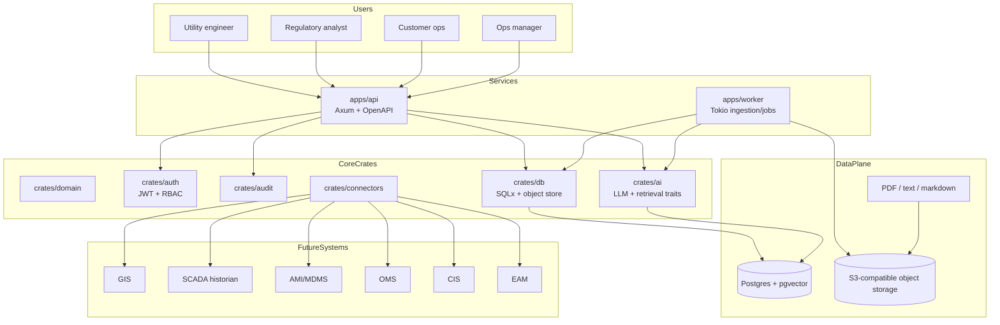

# Architecture

grid-forge is organized as a Rust workspace with explicit boundaries between API delivery, async work, domain types, auth, audit, AI abstractions, database access, object storage, and utility system connectors.

## Request lifecycle

1. User authenticates with JWT.
2. API resolves tenant and role from claims.
3. Route checks RBAC permission for the requested copilot module.
4. Retrieval layer searches document chunks and returns citations.
5. LLM provider receives prompt plus bounded context.
6. Output is returned with citations, confidence, and review flag.
7. Audit event records actor, module, source citations, and decision metadata.

## Async ingestion lifecycle

1. API creates document metadata and stores raw file in object storage.
2. Worker pulls ingestion job.
3. Worker extracts text, chunks content, detects PII, and creates embeddings.
4. Metadata lands in Postgres; vectors land in pgvector or a configured vector store.
5. Document status changes from `uploaded` to `indexed` or `failed`.

The current worker contains a safe demo pipeline and trait boundaries for replacing mock components.
